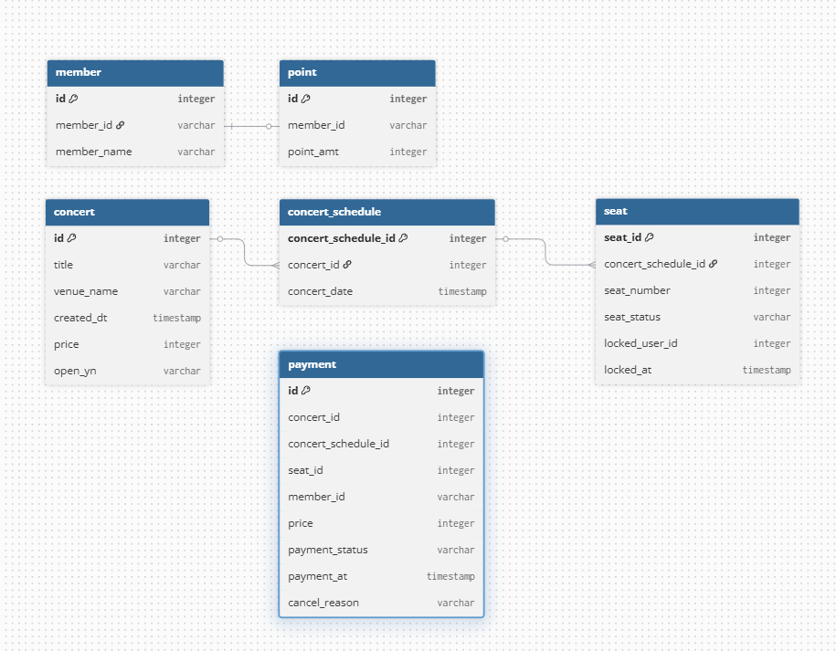
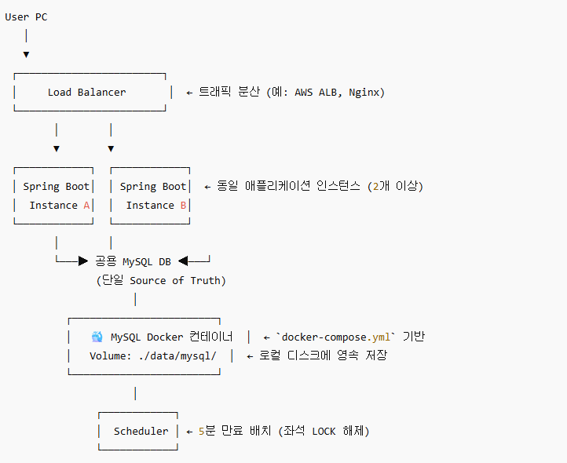

#### Running Docker Containers
`local` profile 로 실행하기 위하여 인프라가 설정되어 있는 Docker 컨테이너를 실행해주셔야 합니다.

```bash
docker-compose up -d
```

# 서버 구조 설계 과제
### 필수
- API 명세서(=Swagger) (http://localhost:8080/swagger-ui/index.html#/)
-------------------
- [ERD 다이어그램]  
  
-------------------
- 인프라
  
-------------------

## 선택
- [시퀀스 다이어그램](./docs/SEQUENCE_DIAGRAM.md)  

